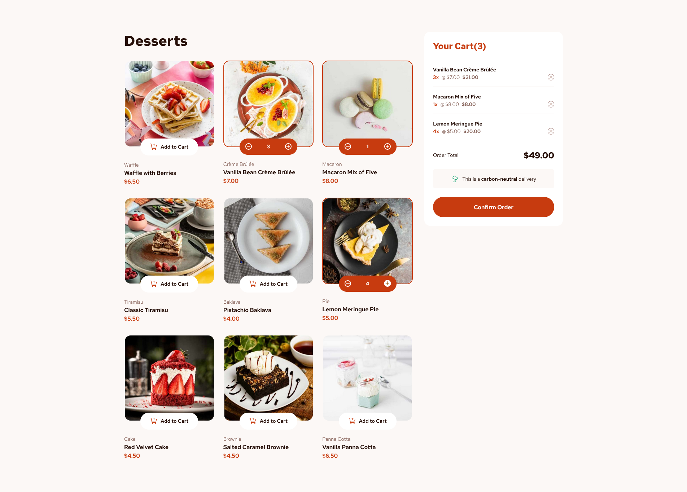
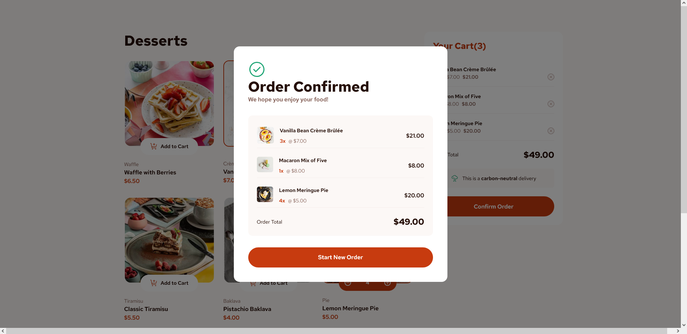

# Product List with Cart - Thomas Sifferle 🛒


[](https://github.com/TomSif)
[](https://reactjs.org/)
[](https://vitejs.dev/)
[](https://tailwindcss.com/)
[](https://www.typescriptlang.org/)



### 🌐 Live Demo:

**[View live site →](https://front-end-mentor-product-list.vercel.app/)**

Deployed on Vercel with HTTPS and performance optimizations.

---

This is a solution to the [Product List with Cart challenge on Frontend Mentor](https://www.frontendmentor.io/challenges/product-list-with-cart-5MmqLVAp_d). Frontend Mentor challenges help you improve your coding skills by building realistic projects.

## Table of contents

- [Overview](#overview)
  - [The challenge](#the-challenge)
  - [Screenshot](#screenshot)
  - [Links](#links)
- [My process](#my-process)
  - [Built with](#built-with)
  - [What I learned](#what-i-learned)
  - [Continued development](#continued-development)
- [Author](#author)
- [Acknowledgments](#acknowledgments)

## Overview

### The challenge

Users should be able to:

- Add items to the cart and remove them
- Increase/decrease the number of items in the cart
- See an order confirmation modal when they click "Confirm Order"
- Reset their selections when they click "Start New Order"
- View the optimal layout for the interface depending on their device's screen size
- See hover and focus states for all interactive elements on the page

### Screenshot



### Links

- Solution URL: [GitHub Repository](https://github.com/TomSif/Front-end_Mentor_Product-List/tree/main)
- Live Site URL: [Vercel Deployment](https://front-end-mentor-product-list.vercel.app/)

## My process

### Built with

- Semantic HTML5 markup
- CSS custom properties
- Mobile-first workflow
- [React 19](https://react.dev/) - JS library
- [TypeScript](https://www.typescriptlang.org/)
- [Vite](https://vitejs.dev/) - Build tool
- [Tailwind CSS v4](https://tailwindcss.com/) - Utility-first CSS (`@import "tailwindcss"`, `@theme` variables, `@utility` presets)
- [clsx](https://github.com/lukeed/clsx) + [tailwind-merge](https://github.com/dcastil/tailwind-merge) — `cn()` utility for conditional classNames

### What I learned

#### Data-first TypeScript — deriving interfaces from `data.json`

As in the previous project, I derived all TypeScript interfaces directly from the shape of the actual JSON rather than imagining the architecture upfront. `data.json` has 9 products with a nested image structure (mobile, desktop, thumbnail), so the interfaces followed naturally:

```ts
interface ProductImage {
  thumbnail: string;
  mobile: string;
  desktop: string;
}

interface Product {
  image: ProductImage;
  name: string;
  category: string;
  price: number;
}
```

`CartItem` was built autonomously in the same session — `name`, `price`, `quantity` — derived directly from what the cart needed to display, not from an upfront design decision.

#### `Record<string, number>` for quantities state

The cart quantity state lives in a single `Record` object in `App`, keyed by product name (used as identifier since `data.json` has no `id` field):

```ts
const [quantities, setQuantities] = useState<Record<string, number>>({});
```

Incrementing and decrementing use computed property names to update a single key immutably, with `Math.max` to prevent going below zero:

```ts
const handleIncrement = (name: string) => {
  setQuantities((prev) => ({ ...prev, [name]: (prev[name] ?? 0) + 1 }));
};

const handleDecrement = (name: string) => {
  setQuantities((prev) => ({
    ...prev,
    [name]: Math.max(0, (prev[name] ?? 0) - 1),
  }));
};
```

Two patterns became concrete here: the `??` operator (null/undefined only, not falsy — distinct from `||`), and computed property names (`[name]: value`) for dynamic object key updates.

#### Deriving `cartItems` — `.filter().map()` and closures

The cart content is never a separate piece of state — it's derived from `quantities` and `data` at every render via a `.filter().map()` chain in `App`:

```ts
const cartItems: CartItem[] = data
  .filter((product) => (quantities[product.name] ?? 0) >= 1)
  .map((product) => ({
    name: product.name,
    price: product.price,
    quantity: quantities[product.name],
  }));
```

The main friction here was understanding how `quantities` is accessible inside the `.filter()` callback — it's in the parent scope and captured as a closure. Working through this with concrete values (not abstract explanations) was what made it click.

The cart total is computed with `.reduce()`:

```ts
const total = cartItems.reduce(
  (acc, item) => acc + item.price * item.quantity,
  0,
);
```

#### Callback types in interfaces — `onXxx: (param: Type) => void`

Each interactive component receives its handlers as typed props. `ProductCard` is a representative example:

```ts
interface ProductCardProps {
  product: Product;
  quantity: number;
  onIncrement: (name: string) => void;
  onDecrement: (name: string) => void;
  onAddToCart: (name: string) => void;
}
```

The syntax for function types in interfaces (`(param: Type) => void`) was a documented fragility from previous projects. This challenge provided multiple real occasions to write it — `onAddToCart`, `onIncrement`, `onDecrement`, `onRemove` — which is what it needed to start anchoring.

#### Native `<dialog>` and `useRef` + `useEffect`

The confirmation modal uses the native HTML `<dialog>` element rather than a JSX conditional or a custom overlay. This gives accessibility for free — focus trap, Escape key handling — without any extra code. The React ↔ DOM synchronisation requires two separate effects:

```ts
const dialogRef = useRef<HTMLDialogElement>(null);

// Effect 1: sync open/close with React state
useEffect(() => {
  if (isOpen) {
    dialogRef.current?.showModal();
  } else {
    dialogRef.current?.close();
  }
}, [isOpen]);

// Effect 2: listen for native close event (Escape key)
useEffect(() => {
  const dialog = dialogRef.current;
  const handleClose = () => onClose();
  dialog?.addEventListener("close", handleClose);
  return () => dialog?.removeEventListener("close", handleClose);
}, [onClose]);
```

The two-effect split was the key insight: mixing the `showModal`/`close` logic with the event listener cleanup in a single effect creates ordering problems. Separating concerns between effects is the correct approach — and was not intuitive at first.

#### Conditional Tailwind class via derived boolean

When a product is in the cart (`quantity > 0`), its `<picture>` element gets a red border. Rather than writing the condition inline in the className, a local boolean makes the intent explicit:

```tsx
const isBordered = quantity > 0;

<picture className={cn("rounded-lg overflow-hidden", isBordered && "ring-2 ring-red")}>
```

This keeps the JSX readable and the boolean naming self-documenting — a pattern cleaner than a ternary directly in the class string.

#### Conventional Commits — `feat` vs `style`

A recurring ambiguity clarified on this project: `style` in Conventional Commits means code formatting (whitespace, semicolons), not CSS or visual changes. Hover states, border additions, layout adjustments — these are `feat` commits because they change observable behaviour.

The atomic commit discipline continued: four commits across the responsive + accessibility + animation session, each scoped to a single concern (`feat(responsive)`, `feat(css)`, `feat(a11y)`, `fix(config)`).

### Continued development

- **Callback types in interfaces** — `(param: Type) => void` is understood but still requires conscious effort. It needs to become as automatic as `string` or `number`.
- **Computed property names** — `{ ...obj, [key]: value }` is used correctly now, but the mental model (brackets = evaluate as key) still needs more repetition before it's truly a reflex.
- **Closures** — understanding how a parent-scope variable is captured in a nested callback still requires reasoning explicitly. The abstraction needs to become more automatic.
- **Multiple `useEffect`** — knowing when to split concerns across two separate effects (rather than combining them) is understood conceptually, but the instinct isn't there yet.
- **`.reduce()` syntax** — usable after seeing an example, but not yet reconstructible from scratch without a reference.

## Author

- Frontend Mentor - [@TomSif](https://www.frontendmentor.io/profile/TomSif)
- GitHub - [@TomSif](https://github.com/TomSif)

## Acknowledgments

This project was built with AI-assisted mentoring (Claude). The approach: I code by hand, Claude acts as a Socratic mentor — asking questions, explaining concepts, reviewing my reasoning. Architectural decisions (what to build, how to structure state, when to split a component) stayed mine.

Specific AI contributions are documented transparently in my [progression log](./progression.md):

- **Written by Claude:** project scaffold (`chore/setup` commits), TypeScript syntax when blocked on generics
- **My initiative:** `CartItem` interface built autonomously, `cartItems` derivation logic, `removeItemFromCart` implementation, architectural decision to keep cart as derived state (no separate `useState`)
- **Collaborative:** debugging the closure in `.filter().map()`, working through `??` vs `||`, two-effect split in `ConfirmationModal`, code review and commit scoping
